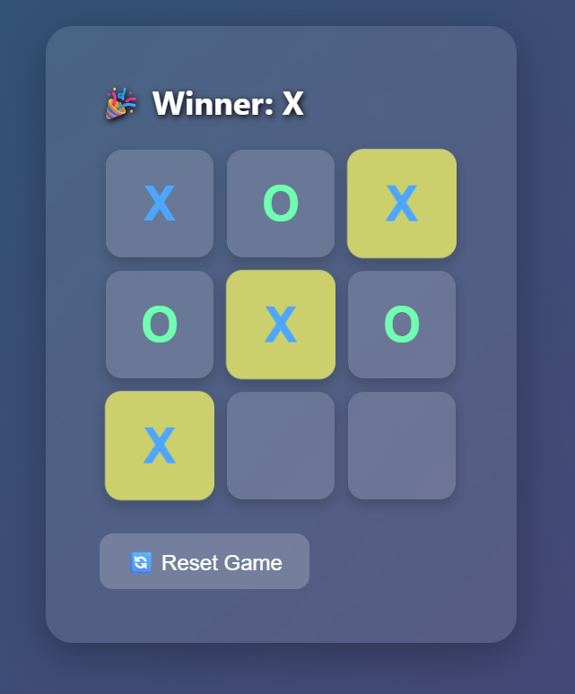

# Fancy Tic-Tac-Toe React App 🎮✨

A modern, stylish Tic-Tac-Toe game built with React.  
Features:
- Responsive 3x3 grid with animated winning highlights  
- Color-coded X and O players  
- Reset button to start a new game  
- Simple and clean UI with glassmorphism style  

## Demo



## Getting Started

### Prerequisites

- Node.js (v14 or newer recommended)  
- npm or yarn package manager

### Installation

```bash
git clone https://github.com/yourusername/fancy-tic-tac-toe.git
cd fancy-tic-tac-toe
npm install
